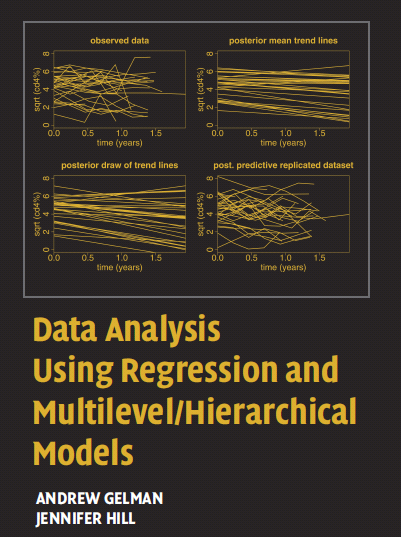

Hierarchical modeling in R
========================================================
author: Sean Raleigh, Westminster College
date: November 10, 2017
autosize:true

Big Mountain Dev and Data Conference, Salt Lake City, UT


========================================================

<div align="center">

</div>


========================================================

<div align="center">

</div>


========================================================

<div align="center">

</div>


========================================================

$$
\DeclareMathOperator{\E}{E}
\DeclareMathOperator{\Var}{Var}
\DeclareMathOperator{\Cov}{Cov}
\begin{align}
Y_{ij}  &= \beta_{0j} + \beta_{1j} X_{ij} + r_{ij} \\
        & \E(r_{ij}) = 0; \Var(r_{ij}) = \sigma^{2} \\
\beta_{0j}  &= \gamma_{00} + \gamma_{01} G_{j} + U_{0j} \\
\beta_{1j}  &= \gamma_{10} + \gamma_{11} G_{j} + U_{1j} \\
        & \E(U_{0j}) = 0; \E(U_{1j}) = 0 \\
        & \E(\beta_{0j}) = \gamma_{00}; \E(\beta_{1j}) = \gamma_{01} \\
        & \Var(\beta_{0j}) = \Var(U_{0j}) = \tau_{00};
          \Var(\beta_{1j}) = \Var(U_{1j}) = \tau_{11} \\
        & \Cov(\beta_{0j}, \beta_{1j}) = \Cov(U_{0j}, U_{1j}) = \tau_{01} \\
        & \Cov(U_{0j}, r_{ij}) = \Cov(U_{1j}, r_{ij}) = 0
\end{align}
$$


Preliminaries:
========================================================


```r
library(tidyverse)
library(broom)
library(lme4)
library(sjPlot)
```


Example
========================================================

Patient data:

* `individual_level_data.csv`
   - `program_id`
   - `sex`
   - `score_admit`
   - `score_discharge`


```r
patients <- read_csv("./data/individual_level_data.csv")
patients$program_id <- factor(patients$program_id)
patients$sex <- factor(patients$sex)
```


Example
========================================================


```r
head(patients)
```

```
# A tibble: 6 x 4
  program_id    sex score_admit score_discharge
      <fctr> <fctr>       <int>           <int>
1          1 FEMALE          15              -7
2          1 FEMALE          57              15
3          1 FEMALE          59             120
4          1 FEMALE          36              20
5          1 FEMALE          71              53
6          1 FEMALE          60              67
```


Example
========================================================

Program data:

* `program_level_data.csv`
   - `program_id`
   - `program_type`
   - `n`


```r
programs <- read_csv("./data/program_level_data.csv")
programs$program_id <- factor(programs$program_id)
programs$program_type <- factor(programs$program_type)
```


Example
========================================================


```r
head(programs)
```

```
# A tibble: 6 x 3
  program_id program_type     n
      <fctr>       <fctr> <int>
1          1            A     8
2          2            B    52
3          3            A    21
4          4            A    26
5          5            A    19
6          6            A     7
```


Start simple...
========================================================
type:section

Just look at average scores.


Start simple...
========================================================

Bad Idea 1: Aggregation, AKA "Complete pooling"


```r
bad_idea_1 <- lm(score_discharge ~ 1,
                 data = patients) %>%
    tidy() %>%
    select(estimate)
```


Start simple...
========================================================

Bad Idea 1: Aggregation, AKA "Complete pooling"


```r
bad_idea_1
```

```
  estimate
1 34.74024
```

This is just the mean:


```r
mean(patients$score_discharge)
```

```
[1] 34.74024
```


Start simple...
========================================================

Bad Idea 2: Disaggregation, AKA "No pooling"


```r
bad_idea_2 <- patients %>%
    group_by(program_id) %>%
    nest() %>%
    transmute(fit = map(data,
                ~ tidy(lm(score_discharge ~ 1,
                          data = .x)))) %>%
    unnest() %>%
    select(estimate)
```


Start simple...
========================================================

Bad Idea 2: Disaggregation, AKA "No pooling"


```r
head(bad_idea_2)
```

```
# A tibble: 6 x 1
  estimate
     <dbl>
1 49.50000
2 34.92308
3 23.23810
4 29.34615
5 29.78947
6 21.00000
```


Start simple...
========================================================

Bad Idea 2: Disaggregation, AKA "No pooling"

These are just the program means:


```r
patients %>%
    group_by(program_id) %>%
    summarize(mean(score_discharge)) %>% head()
```

```
# A tibble: 6 x 2
  program_id `mean(score_discharge)`
      <fctr>                   <dbl>
1          1                49.50000
2          2                34.92308
3          3                23.23810
4          4                29.34615
5          5                29.78947
6          6                21.00000
```


Start simple...
========================================================

Good idea: Hierarchical modeling, AKA "Partial pooling"


```r
good_idea_model <- lmer(
    score_discharge ~ (1 | program_id),
    data = patients)
```


Start simple...
========================================================

Good idea: Hierarchical modeling, AKA "Partial pooling"


```r
fixef(good_idea_model)
```

```
(Intercept) 
   31.62485 
```


Start simple...
========================================================

Good idea: Hierarchical modeling, AKA "Partial pooling"


```r
ranef(good_idea_model)$program_id %>% head()
```

```
  (Intercept)
1   10.171421
2    2.954024
3   -6.508776
4   -1.848023
5   -1.391592
6   -5.695171
```


Start simple...
========================================================

Good idea: Hierarchical modeling, AKA "Partial pooling"


```r
good_idea <- fixef(good_idea_model) +
    ranef(good_idea_model)$program_id %>%
    rename(estimate = `(Intercept)`)
head(good_idea)
```

```
  estimate
1 41.79627
2 34.57887
3 25.11607
4 29.77682
5 30.23325
6 25.92968
```


========================================================


Add predictors
========================================================
type:section


Add predictors
========================================================

Join `patients` and `programs`


```r
all_data <- inner_join(patients,
                       programs,
                       by = "program_id")
```


Add predictors
========================================================

Bad Idea 1 Redux: Aggregation, AKA "Complete pooling"


```r
bad_idea_1_redux <-
    lm(score_discharge ~ score_admit,
       data = patients) %>%
    tidy() %>%
    select(term, estimate) %>%
    spread(term, estimate) %>%
    rename(intercept = `(Intercept)`)
```


Add predictors
========================================================

Bad Idea 1 Redux: Aggregation, AKA "Complete pooling"


```r
bad_idea_1_redux
```

```
  intercept score_admit
1  13.65125    0.308051
```


Add predictors
========================================================

Bad Idea 2: Disaggregation, AKA "No pooling"


```r
bad_idea_2_redux <- patients %>%
    group_by(program_id) %>%
    nest() %>%
    transmute(fit = map(data,
        ~ tidy(lm(score_discharge ~ score_admit,
                          data = .x)))) %>%
    unnest(.id = "program_id") %>%
    mutate(program_id =
               as.integer(program_id)) %>%
    select(program_id, term, estimate) %>%
    spread(term, estimate) %>%
    rename(intercept = `(Intercept)`)
```


Add predictors
========================================================

Bad Idea 2: Disaggregation, AKA "No pooling"


```r
head(bad_idea_2_redux)
```

```
# A tibble: 6 x 3
  program_id intercept score_admit
       <int>     <dbl>       <dbl>
1          1 -9.780508   0.9963111
2          2 13.800500   0.2726170
3          3 -3.694078   0.4183252
4          4  8.621399   0.2806477
5          5 15.639619   0.1695128
6          6 15.049439   0.1236022
```


Add predictors
========================================================

Hierarchical, but still a bad idea: Varying intercepts


```r
var_int <- lmer(
    score_discharge ~ score_admit +
        (1 | program_id),
    data = all_data)
```


Add predictors
========================================================

Hierarchical, but still a bad idea: Varying intercepts


```r
fixef(var_int)
```

```
(Intercept) score_admit 
 11.1060690   0.3087433 
```


Add predictors
========================================================

Hierarchical, but still a bad idea: Varying intercepts


```r
ranef(var_int)$program_id %>% head()
```

```
  (Intercept)
1 11.95211325
2 -0.09481184
3 -6.16031399
4 -3.77500291
5 -5.51917086
6 -2.80497068
```


Add predictors
========================================================

Hierarchical, but still a bad idea: Varying intercepts


```r
ranef(var_int)$program_id %>%
    mutate(intercept = `(Intercept)` +
               fixef(var_int)[1]) %>%
    select(-`(Intercept)`) %>% head()
```

```
  intercept
1 23.058182
2 11.011257
3  4.945755
4  7.331066
5  5.586898
6  8.301098
```


========================================================


Add predictors
========================================================

Good idea: Varying intercepts and slopes


```r
var_int_slope <- lmer(
    score_discharge ~ score_admit +
        (1 + score_admit | program_id),
    data = all_data)
```


Add predictors
========================================================

Good idea: Varying intercepts and slopes


```r
fixef(var_int_slope)
```

```
(Intercept) score_admit 
 12.9582097   0.2872658 
```


Add predictors
========================================================

Good idea: Varying intercepts and slopes


```r
ranef(var_int_slope)$program_id %>% head()
```

```
  (Intercept)  score_admit
1  3.74238036  0.209139978
2 -0.07194651 -0.004020674
3 -1.27664770 -0.071344451
4 -0.74475261 -0.041619913
5 -1.20646713 -0.067422465
6 -1.10857099 -0.061951616
```


Add predictors
========================================================

Good idea: Varying intercepts and slopes


```r
good_idea_redux <-
    ranef(var_int_slope)$program_id %>%
    mutate(intercept = `(Intercept)` +
               fixef(var_int_slope)[1],
           score_admit = score_admit +
               fixef(var_int_slope)[2]) %>%
    select(-`(Intercept)`) %>%
    rownames_to_column("program_id") %>%
    select(program_id, intercept, score_admit)
```


Add predictors
========================================================

Good idea: Varying intercepts and slopes


```r
head(good_idea_redux)
```

```
  program_id intercept score_admit
1          1  16.70059   0.4964058
2          2  12.88626   0.2832452
3          3  11.68156   0.2159214
4          4  12.21346   0.2456459
5          5  11.75174   0.2198434
6          6  11.84964   0.2253142
```


========================================================


========================================================


========================================================

<div align="center">

</div>


Thank you!
========================================================
type:section

[sraleigh@westminstercollege.edu](mailto:sraleigh@westminstercollege.edu)

[github.com/VectorPosse](https://github.com/VectorPosse)
